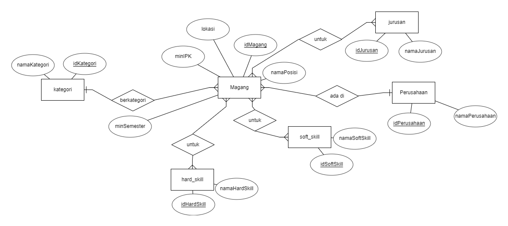
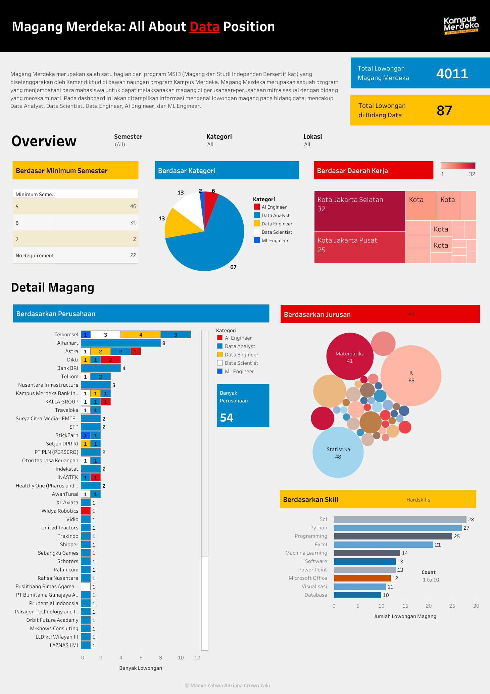

# Data Jobs Internship Analysis (MSIB 2023)

### Project Overview

This project is all about checking out internship opportunities in the data field, specifically from Kampus Merdeka. The main goal is to make it easier to find internship requirements by putting together data from different programs. The project includes web scraping, cleaning up the data, and creating a dashboard with Tableau. To understand the data a little bit more, I also made a simple diagram to show how different pieces of data are connected.

### Dataset, Tools, and Algorithm

Source: Kampus Merdeka Magang MSIB Page 

Tools: VSCode (Python), Tableau

Library: Selenium

### Steps

**1. Web Scraping (`scrape-kampus-merdeka.ipynb`)**

In this project, Selenium served as the primary library for web scraping. I systematically gathered information on internship positions, locations, companies, and detailed descriptions, including the necessary requirements. I focused on key terms such as "Data Analyst," "Data Scientist," "ML Engineer," "Data Engineer," "AI Engineer," "Analis Data," "Data Analytic," "Machine Learning," and "Artificial Intelligence."

**2. Data Preprocessing (`clean_data.ipynb`)**

Given the textual nature of the data, this step involved significant effort and attention. I began by extracting information through manual processes like splitting descriptions. Further extraction involved identifying minimum semester requirements, GPAs, major prerequisites, and required skills. The extraction process included keyword searches such as 'semester,' 'IPK' (GPA), and 'jurusan' (major). Subsequently, data cleaning ensued, involving renaming majors and skills, grouping related majors, and categories, and addressing null values by marking them as 'no requirement.'

**3. Data Segmentation (`bikin_tabel.ipynb`)**

Due to the interdependencies within the data, I opted to segregate it into distinct datasets. The initial step involved creating an Entity-Relationship Diagram (ERD) to guide the structuring process. While ERDs are typically associated with SQL databases, I employed this approach for organizational clarity. The ERD guided the creation of new features for each data group, utilizing unique IDs to establish connections between them.

**4. Data Visualization**

Navigating through Tableau for the first time presented challenges, but I successfully created a comprehensive dashboard consisting of six interactive graphs. The inclusion of filters and actions enhances the user experience, allowing readers to access specific information seamlessly. For a more immersive experience, I recommend exploring the interactive dashboard on Tableau Public, where you can utilize filters to extract precise insights.

Link Tableau Public: https://public.tableau.com/app/profile/maeve.zahwa.adriana.crown.zaki/viz/MBKMMagangMerdekaBidangData/Dashboard1#1
